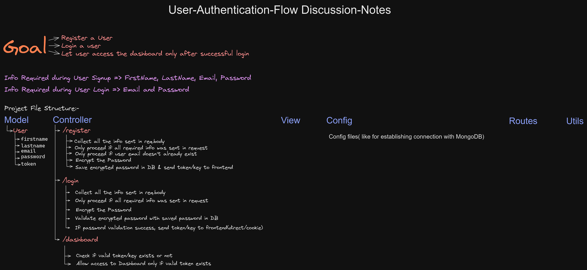

# User-Authentication-Backend-Application


**Application Flow:** 

**This Web App uses following:**

1. Tech Stack used: MongoDB, NodeJS, ExpressJS, JavaScript

1. npm packages used: 

    "bcryptjs": "^2.4.3",

    "cookie-parser": "^1.4.6",

    "dotenv": "^16.0.3",

    "express": "^4.18.2",

    "jsonwebtoken": "^9.0.0",

    "mongoose": "^6.8.1"

1. We also need:
    
    1. NodeJS >= v16

    1. NPM >= 8

    1. MongoDB Atlas account, Create a Project and a Cluster, then get the **MongoDB Compass Connection String** from under **Deployment > Database > Connect** 
#

## Please follow below instructions to run this application successfully on our local system:

1.  We need to download this repository and go to project directory in terminal on our local system.

1.  How to run this code:

    1. On Terminal, under project directory, to install dependencies, run command: npm install 

    1. We need to create a file within our Project directory with this name- **.env** and add following Environment Variables in it:
        ```
        
        PORT=3000
        MONGO_DB_URL= <MongoDB Compass Connection String comes here>
        AUTH_SECRET= <Mention a secret code/>string here which will be used in encryption & decryption algorithms>

        ```
        **NOTE:** We can keep the connection string and secret code without quotes

    1. To run the application, run command: npm start
    
    1. Now, we can use postman or a front-end app to access: 
    
        1. localhost:3000/register to Register a User
            
            - Please provide the mandatory info in your request's body( in JSON format) for successful registration:
                ```
                {
                    "firstname":"Abcdef",
                    "lastname":"uvwxyz",
                    "email":"abc@google.com",
                    "password":"asdfjkl"
                }
                ```

        1. localhost:3000/login to login the User
            
            - Please provide the mandatory info in your request's body( in JSON format) for successful login:
                ```
                {
                    "email":"abc@google.com",
                    "password":"asdfjkl"
                }
                ```

        1. localhost:3000/profile to get profile info in response(only allowed if user has logged in recently)


#


Developed By:

**Sidharth Pandey**

[Email](mailto:Sidp0008@gmail.com) | [LinkedIn](https://linkedin.com/in/sidp919)


Happy Learning! ☺️